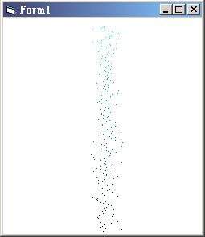

<div align="center">

## o0\~\)\_Cool 3D partical movement\~\(\_0o


</div>

### Description

I was just messing around and I did this on accident, but it looks really cool, so I thought I'd post it. This is the second thing that I made when I was messing around, and it's really cool too. It also might work in other VBs, I wasn't sure though.
 
### More Info
 


<span>             |<span>
---                |---
**Submitted On**   |
**By**             |[Jason Ryczek](https://github.com/Planet-Source-Code/PSCIndex/blob/master/ByAuthor/jason-ryczek.md)
**Level**          |Intermediate
**User Rating**    |3.8 (15 globes from 4 users)
**Compatibility**  |VB 5\.0, VB 6\.0
**Category**       |[Graphics](https://github.com/Planet-Source-Code/PSCIndex/blob/master/ByCategory/graphics__1-46.md)
**World**          |[Visual Basic](https://github.com/Planet-Source-Code/PSCIndex/blob/master/ByWorld/visual-basic.md)
**Archive File**   |[](https://github.com/Planet-Source-Code/jason-ryczek-o0-cool-3d-partical-movement-0o__1-22103/archive/master.zip)


### Source Code

```
' =-=-=-=-=-=-=-=-=-=-=
' Add a timer, with intervals of 1
' -=-=-=-=-=-=-=-=-=-=-
' This is a really simlpe and cool little program that I made
' on accident trying to make something resembling, well, something
' different. But I thought this looked cool, and I thought that
' someone might want to put it in the back of a game. If anyone does
' please give me a lil credit, thanx.
' ~Jason Ryczek - CCguy7@aol.com
Dim red(0 To 256) As Integer, green(0 To 256) As Integer, blue(0 To 256) As Integer
Dim RadialGrow As Boolean
Sub ColorFade()
Me.Cls
For i = 0 To 256 Step 1
 red(i) = i
 ' the number 1 is the radial size, change that to make the
 ' radial size around the axis
 green(i) = green(i) + (Rnd * 1) + (Rnd * -1)
 If RadialGrow = True Then
 If green(i) > 256 Or green(i) < 0 Then
 green(i) = 256 / 2
 End If
 End If
 PSet (green(i), red(i) + 10), RGB(0, 256 - i, 256 - i)
Next
End Sub
Private Sub Form_Load()
For i = 0 To 256 Step 1
 green(i) = 256 / 2
Next
' this makes it so that the radius keeps growing
RadialGrow = True
End Sub
Private Sub Timer1_Timer()
ColorFade
Timer1.Interval = 1
End Sub
```

